Here is a command to play with for producing some kind of atom. 

```bash
python layer_axiom_game.py --prefill --fillA="A, , , , , , , , , , , , , , ,E" --fillB="B, , , , , , , , , , , , , , , " --fillC="A, , , , , , , , , , , , , , ,-" --fillD="B, , , , , , , , , , , , , , , " --fillE="B, , , , , , , , , , , , , , , E" --fillF="B, , , , , , , , , , , , , , , " --fillH="B, , , , , , , , , , , , , , , " --fillI="B, , , , , , , , , , , , , , ,E" --fillJ="B,,,,,,,,,,,,,,,," --mode=full
```
Might need to play with opacity e.g. [149-151] | [155-163]
```python
opacityADH = 0
opacityBEI = 1
opacityCFJ = 0
```

or even a wider atom:

```bash
python layer_axiom_game.py --prefill --fillA="A, , , , , , , , , , , , , , , , , , , ,E, , , , ,E" --fillB="B, , , , , , , , , , , , , , , , , , , ,E, , , , ,E" --fillC="A, , , , , , , , , , , , , , , , , , , ,E, , , , ,E" --fillD="B, , , , , , , , , , , , , , , , , , , ,E, , , , ,E" --fillE="B, , , , , , , , , , , , , , , , , , , ,E, , , , ,E" --fillF="B, , , , , , , , , , , , , , , , , , , ,E, , , , ,E" --fillH="B, , , , , , , , , , , , , , , , , , , ,E, , , , ,E" --fillI="B, , , , , , , , , , , , , , , , , , , ,E, , , , ,E" --fillJ="B, , , , , , , , , , , , , , , , , , , ,E, , , , ,E" --mode=full
```

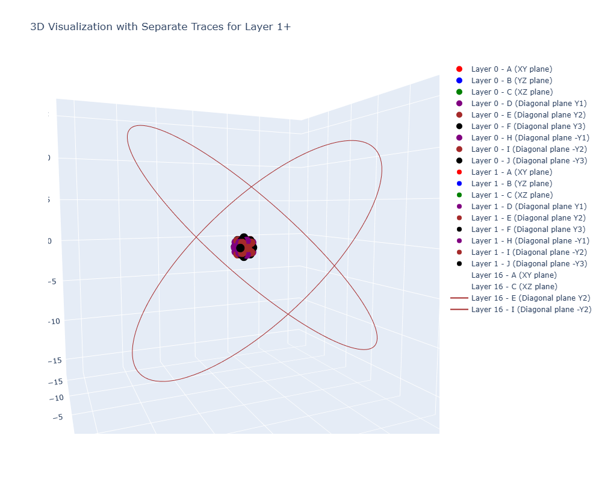

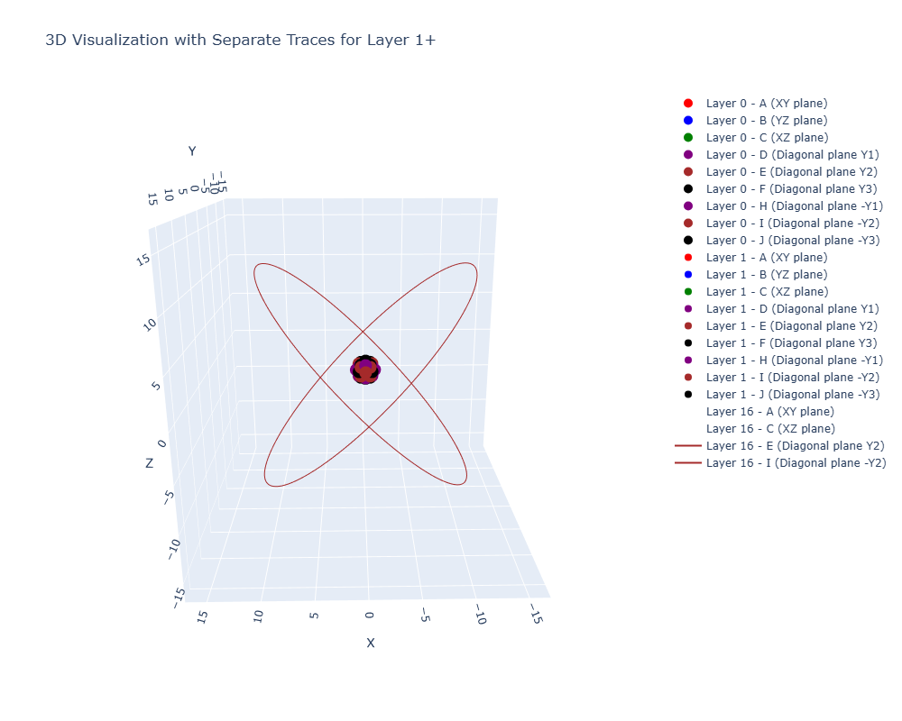
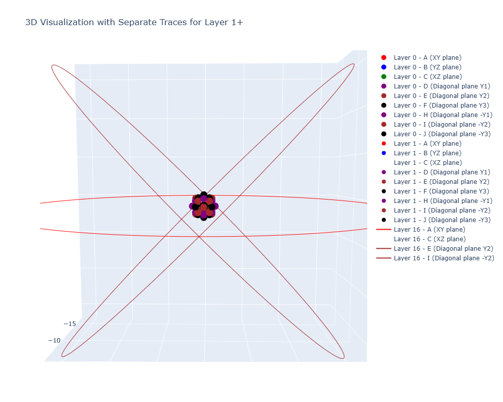
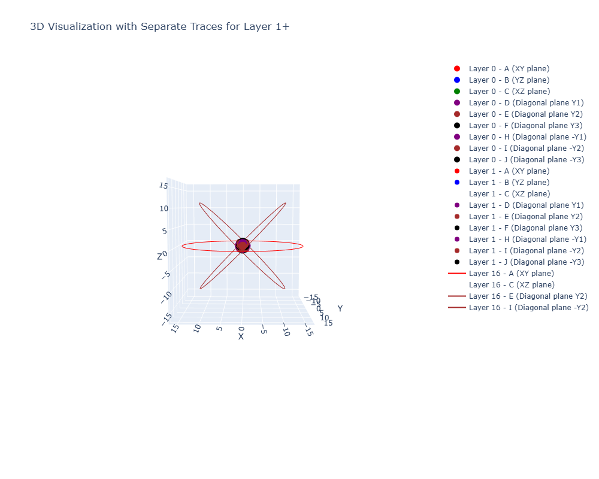
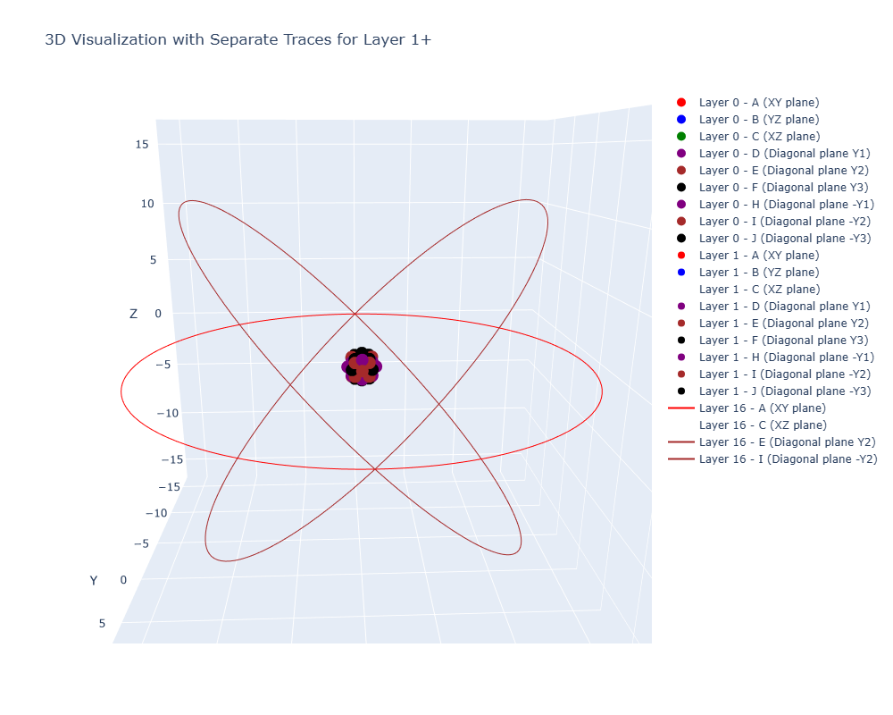
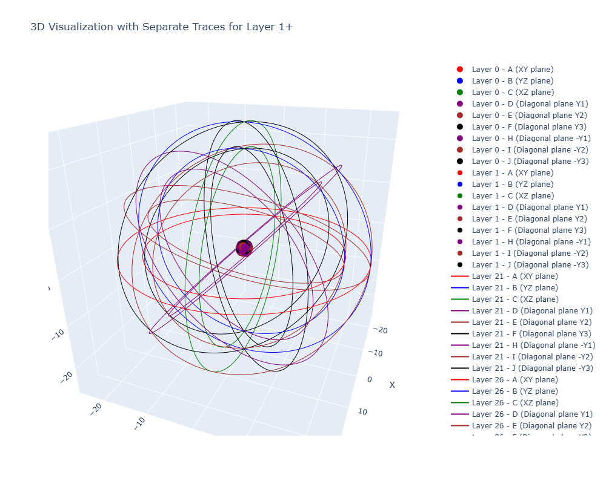
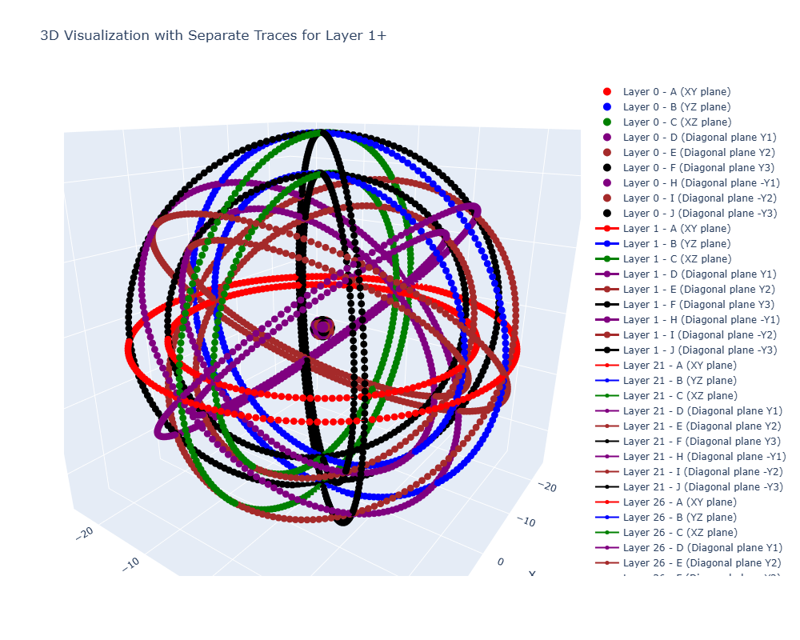
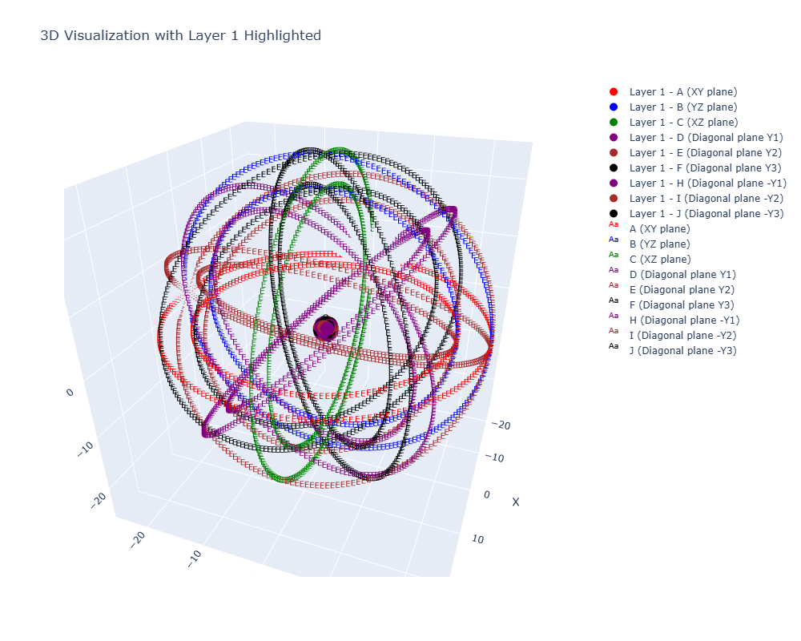
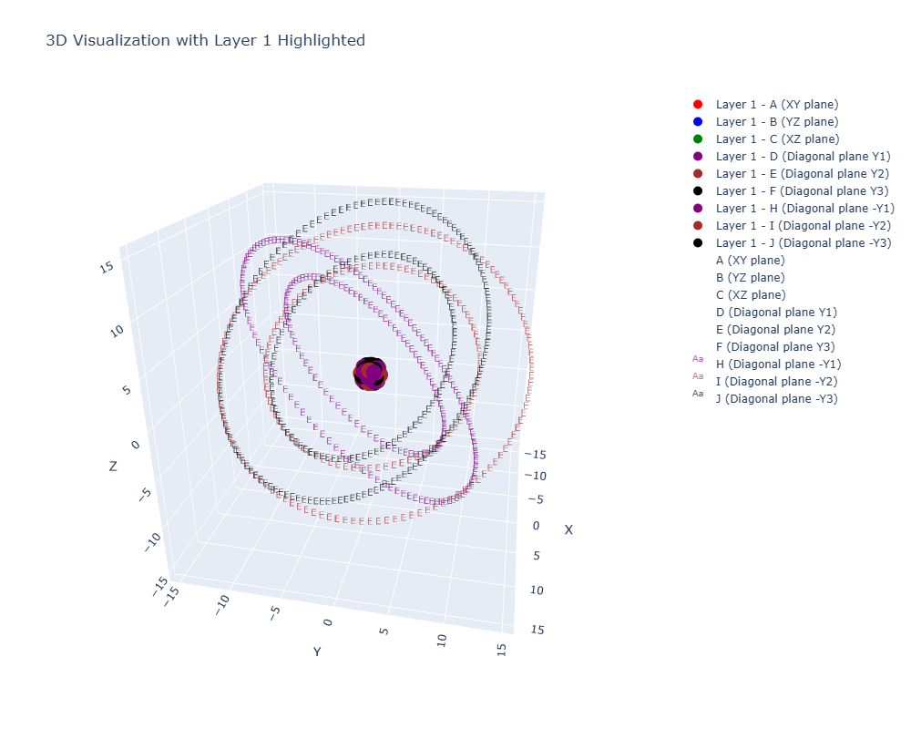
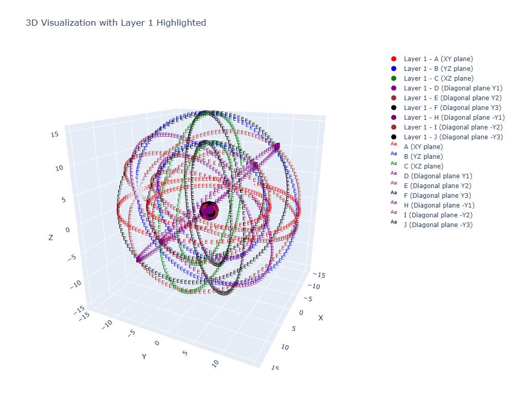
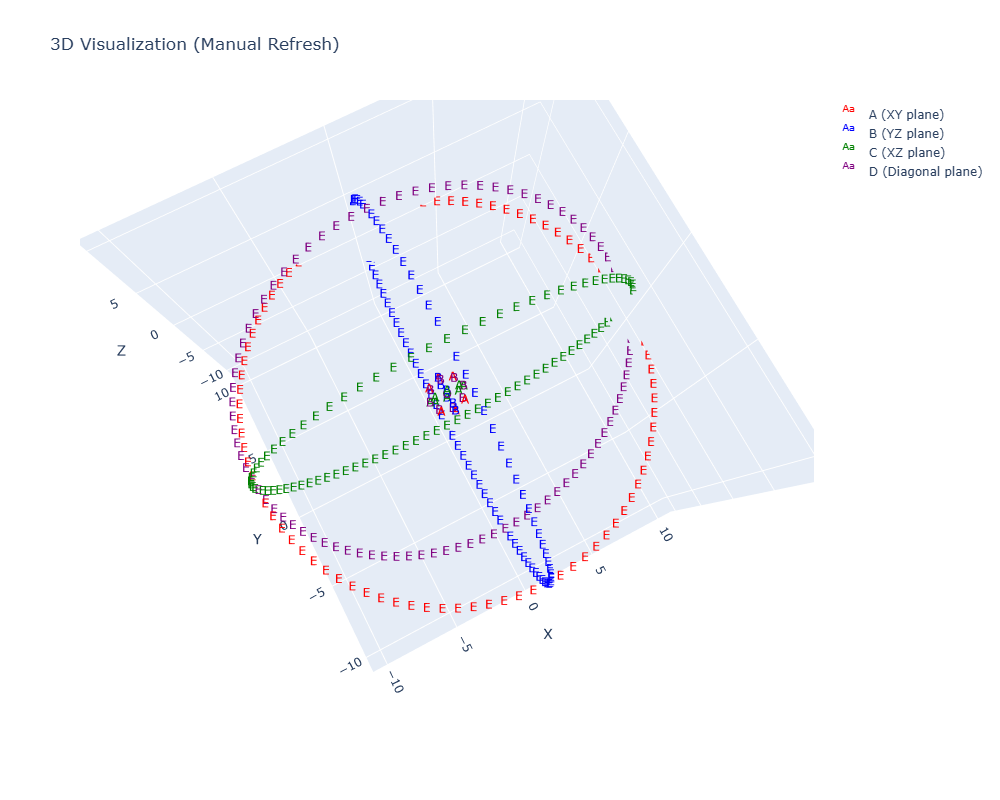
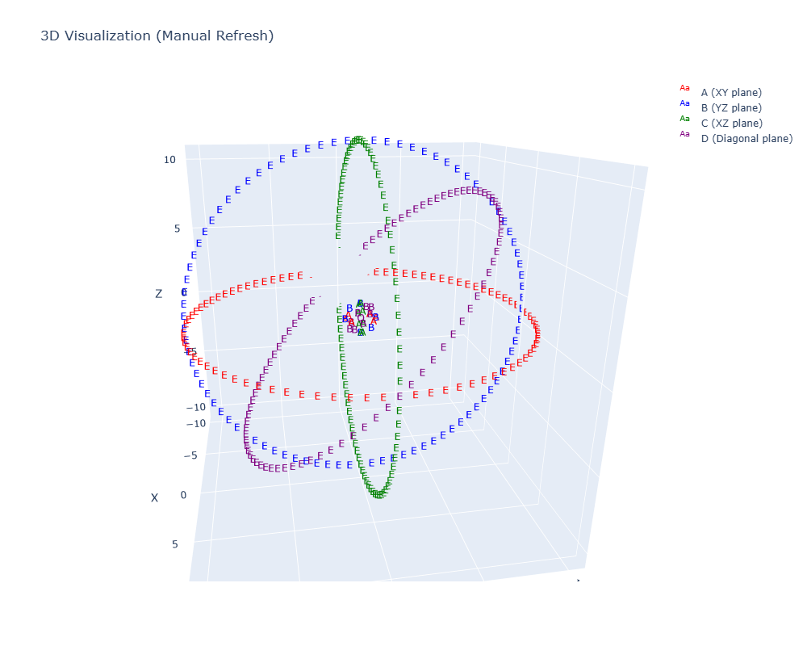

