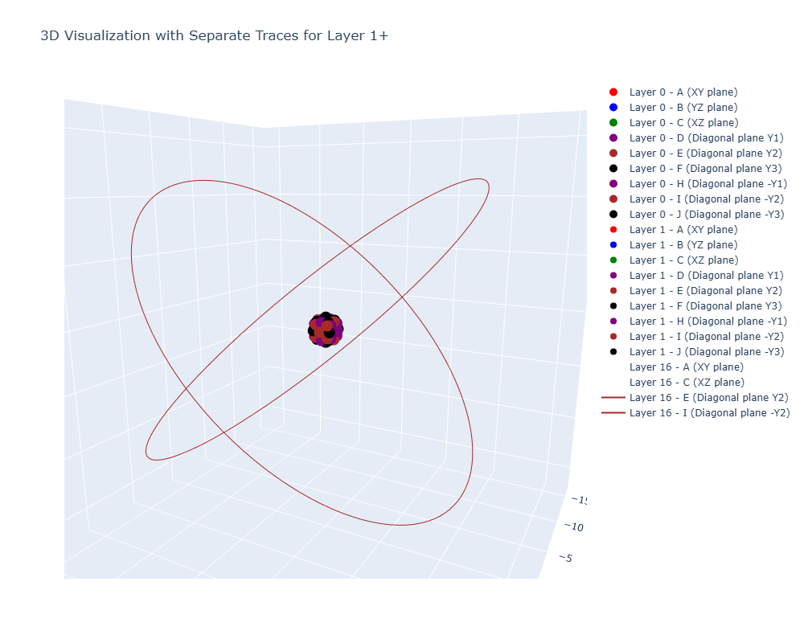
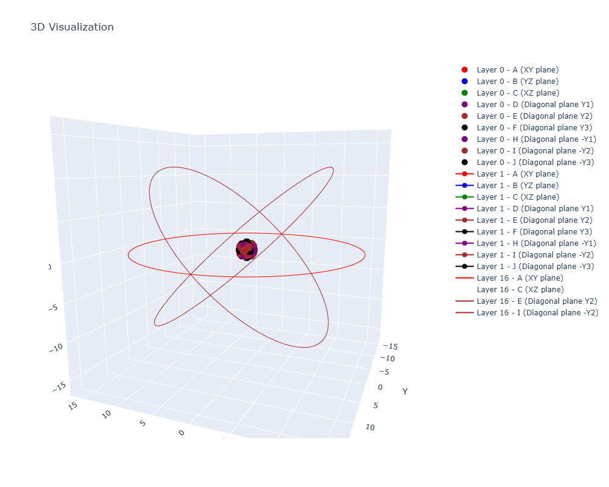
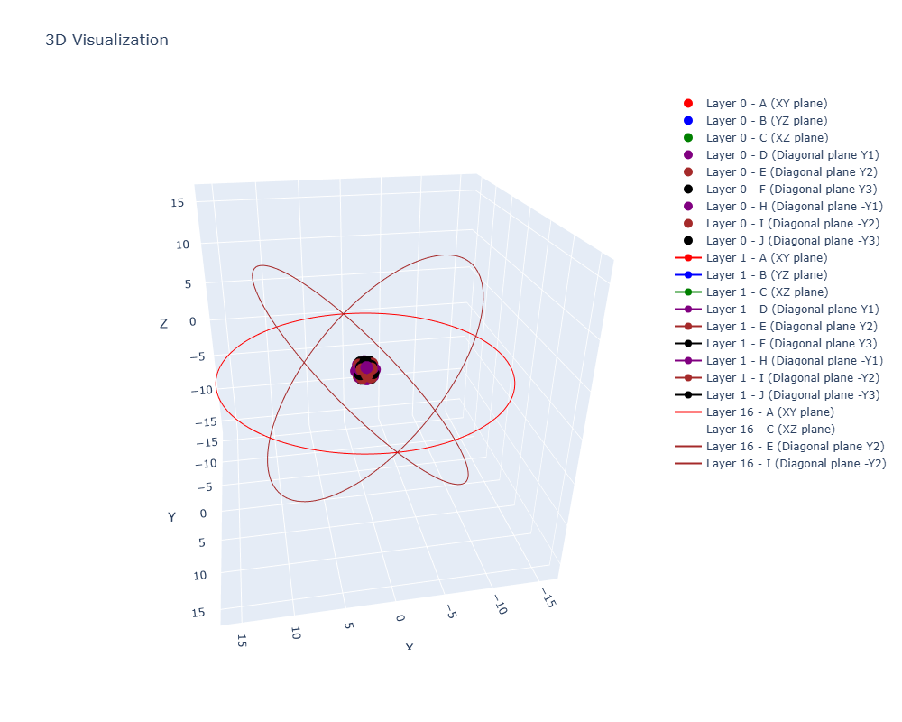

Here is a command to play with for producing some kind of atom. 

```bash
python layer_axiom_game.py --prefill --fillA="A, , , , , , , , , , , , , , ,E" --fillB="B, , , , , , , , , , , , , , , " --fillC="A, , , , , , , , , , , , , , ,-" --fillD="B, , , , , , , , , , , , , , , " --fillE="B, , , , , , , , , , , , , , , E" --fillF="B, , , , , , , , , , , , , , , " --fillH="B, , , , , , , , , , , , , , , " --fillI="B, , , , , , , , , , , , , , ,E" --fillJ="B,,,,,,,,,,,,,,,," --mode=full
```
Might need to play with AXIOM_CONFIGS opacity e.g. [33-44](../layer_axiom_game.py#L33)
```python
# Axiom Settings
AXIOM_CONFIGS = {
    'A': {'color': 'red', 'label': 'A (XY plane)', 'opacity': 1},
    'B': {'color': 'blue', 'label': 'B (YZ plane)', 'opacity': 0},
    'C': {'color': 'green', 'label': 'C (XZ plane)', 'opacity': 0},
    'D': {'color': 'purple', 'label': 'D (Diagonal plane Y1)', 'opacity': 0},
    'E': {'color': 'brown', 'label': 'E (Diagonal plane Y2)', 'opacity': 1},
    'F': {'color': 'black', 'label': 'F (Diagonal plane Y3)', 'opacity': 0},
    'H': {'color': 'purple', 'label': 'H (Diagonal plane -Y1)', 'opacity': 0},
    'I': {'color': 'brown', 'label': 'I (Diagonal plane -Y2)', 'opacity': 1},
    'J': {'color': 'black', 'label': 'J (Diagonal plane -Y3)', 'opacity': 0},
}
```

or even a wider atom:

```bash
python layer_axiom_game.py --prefill --fillA="A, , , , , , , , , , , , , , , , , , , ,E, , , , ,E" --fillB="B, , , , , , , , , , , , , , , , , , , ,E, , , , ,E" --fillC="A, , , , , , , , , , , , , , , , , , , ,E, , , , ,E" --fillD="B, , , , , , , , , , , , , , , , , , , ,E, , , , ,E" --fillE="B, , , , , , , , , , , , , , , , , , , ,E, , , , ,E" --fillF="B, , , , , , , , , , , , , , , , , , , ,E, , , , ,E" --fillH="B, , , , , , , , , , , , , , , , , , , ,E, , , , ,E" --fillI="B, , , , , , , , , , , , , , , , , , , ,E, , , , ,E" --fillJ="B, , , , , , , , , , , , , , , , , , , ,E, , , , ,E" --mode=full
```









